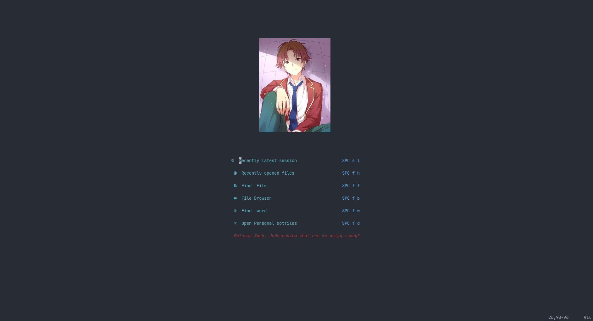
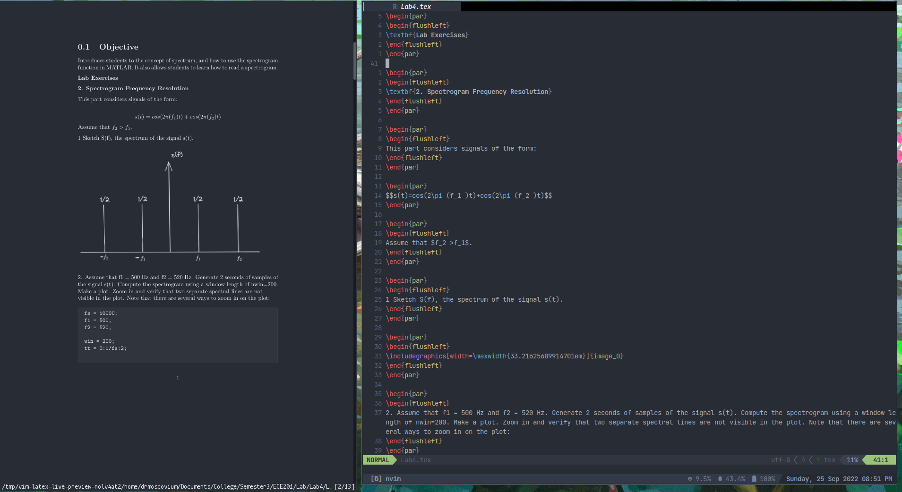
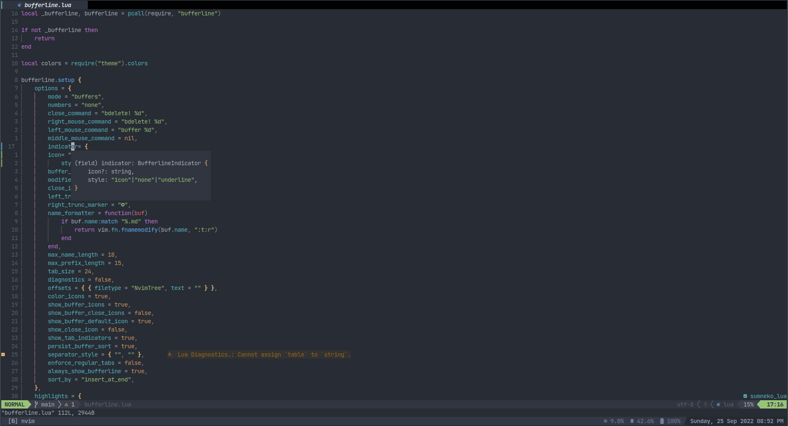

# LEETVim
A Neovim config that's totally not copied




## How to install?

You can use `GNU stow` to stow the config file to do that

For Arch:
```bash
sudo pacman -S stow
```
For Debian:
```bash
sudo apt install stow
```

```bash
git clone https://github.com/Super-Yojan/LEETVim ~/.LEETVim
cd ~/.LEETVim
stow nvim
```

## Screenshots

:LLPStartPreview

Opens latex in zathura.





## Issues
If packer isn't automatically installed install it with following command.
```bash
git clone --depth 1 https://github.com/wbthomason/packer.nvim\
 ~/.local/share/nvim/site/pack/packer/start/packer.nvim
```


